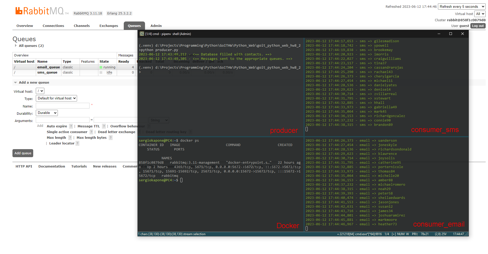

# Домашнє завдання 8 (друга частина)

Використання [`RabbitMQ`](https://www.rabbitmq.com/)[^1] для імітації розсилки за допомогою черг. Імітується розсилка на `email` та `sms`. Дані про контакти беруться з бази даних `MongoDB`.

[^1]: RabbitMQ - це брокер повідомлень, який маршрутизує повідомлення за всіма базовими принципами протоколу `AMQP`. Відправник передає повідомлення брокеру, а той доставляє його одержувачу.

## Вигляд вікна проекту



## Встановлення Docker-образу `RabbitMQ`

Встановити локально сервіс `RabbitMQ` можна за допомогою [`Docker`-образу](https://hub.docker.com/_/rabbitmq):

```shell
docker run -d --name rabbitmq -p 5672:5672 -p 15672:15672 rabbitmq:3.11-management
```

Для входження в адмінку в браузері наберіть адресу [http://localhost:15672](http://localhost:15672/) і використовуйте логін і пароль `guest`.

## Установка проекту

Для управління залежностями проекту використовується `pipenv`. Необхідно встановити `pipenv` перед виконанням наступних кроків:

- Склонируйте репозиторий:

  ```shell
  git clone https://github.com/sergiokapone/goit_python_web_hw8_2.git
  ```

- Для встановлення залежностей використайте команду `pipenv install` або `pipenv sync`.

## Виклик `producer`'а

Для заповнення бази даних та виклику `producer`'а запустіть

```shell
python producer.py
```

`producer` встановить зв'язок з базою даних (яка знаходиться в хмарі) та з брокером, що запущений у режимі `Docker`-демона і завантадить фейкові дані в базу `MongoDB` вигляду:

```json
{
  "_id": {
    "$oid": "64870f0765e861cbde664827"
  },
  "username": "tyler97",
  "email": "tyler97@williams-fitzpatrick.org",
  "sent": false,
  "phone_number": "(787)441-2661",
  "preferred_contact_method": "email"
}
```

та створить дві черги в `RabbitMQ`: `email_queue` та `sms_queue`:


### Запуск `consumer`'ів

Після завершення роботи `producer`'а можна запустити `consumer_sms`

```shell
python consumer_sms.py
```

та `consumer_email`

```shell
python consumer_email.py
```

Якщо в черзі будуть завдання вони почнуть їх виконувати та логувати, імітуючи розсилку:


При спустошенні черги `consumer`'и залишаються в режимі очікування доки `producer` не згенерує нові завдання.

## Схема роботи


